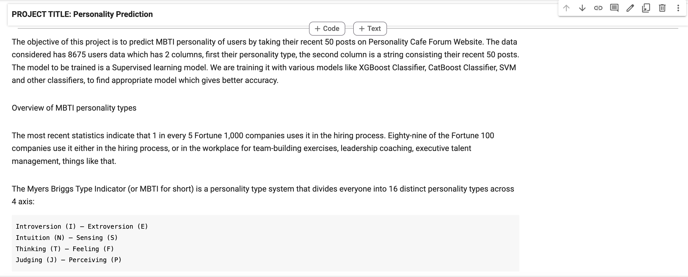
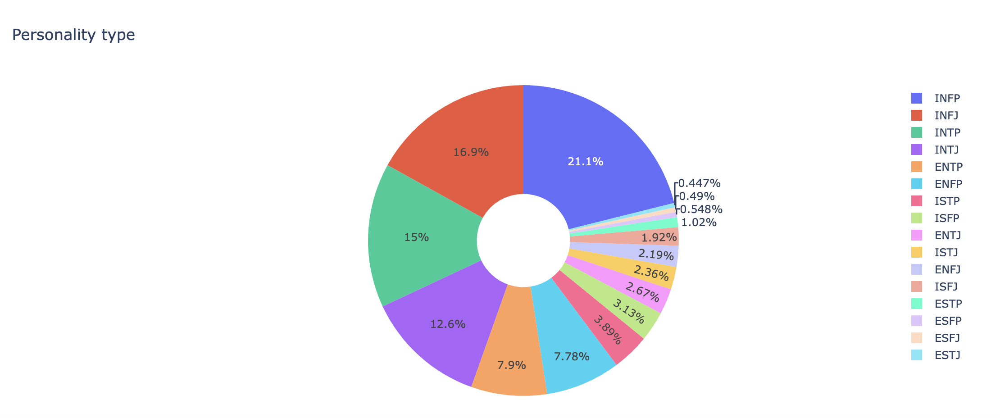
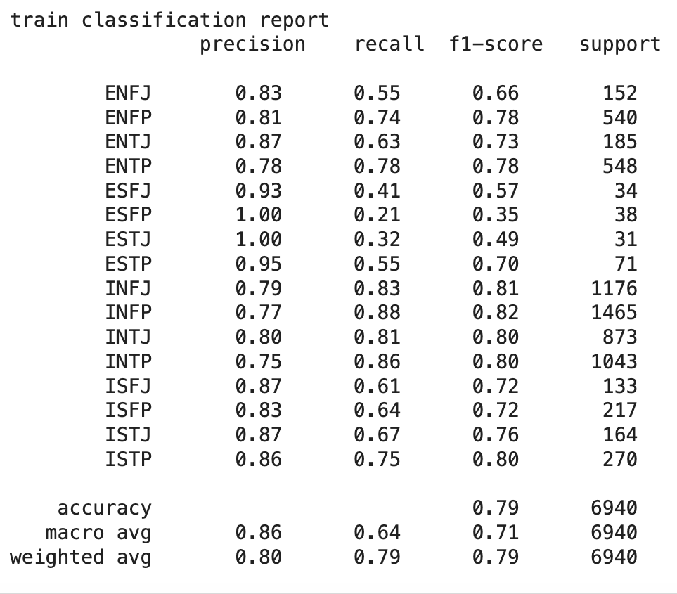
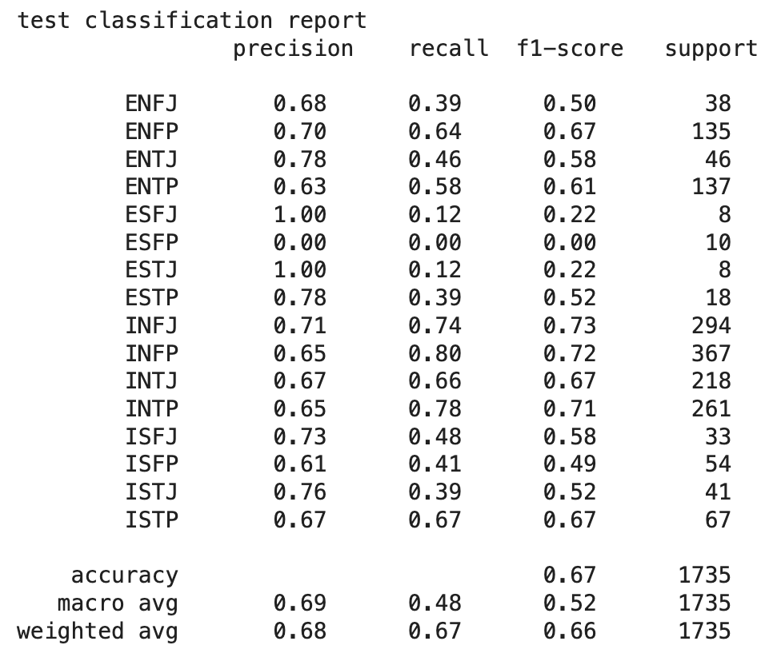
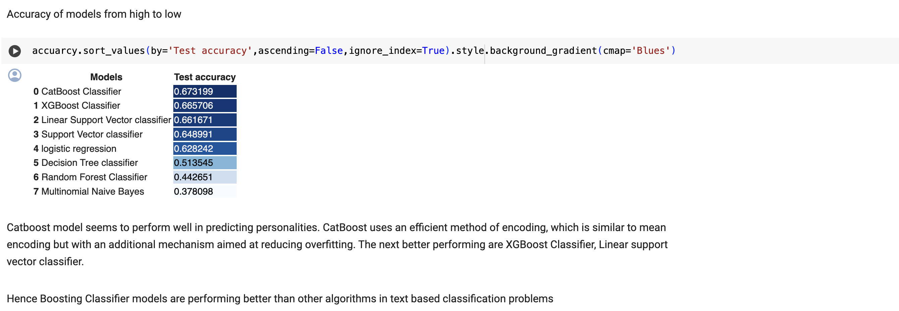

**Project Title : Personality Prediction**

**Name :** Rishabh Sharma

**Project Description:** The objective of this
project is to predict MBTI personality of users
by taking their recent 50 posts on Personality Cafe
Forum Website. The data considered has 8675 users data
which has 2 columns, first their personality type,
the second column is a string consisting their
recent 50 posts.

**Technical Skillset:** NLP, ML

> ➢ Background of Data : Overview of 16 MBTI personality types and the
> dataset
> considered
>
> ➢ Understanding data : Distribution of personality types in data taken
>
> ➢
> Training and Performance of CatBoost Classifier
>
> 
>
> ➢ F1-score, precision achieved by Catboost Classifier on test data
>
> 
>
> ➢ Accuracy by models trained from high to low.
>
> Boosting classifiers performed well than others, CatBoost classifier
> showed high F1-score compared to other models.

